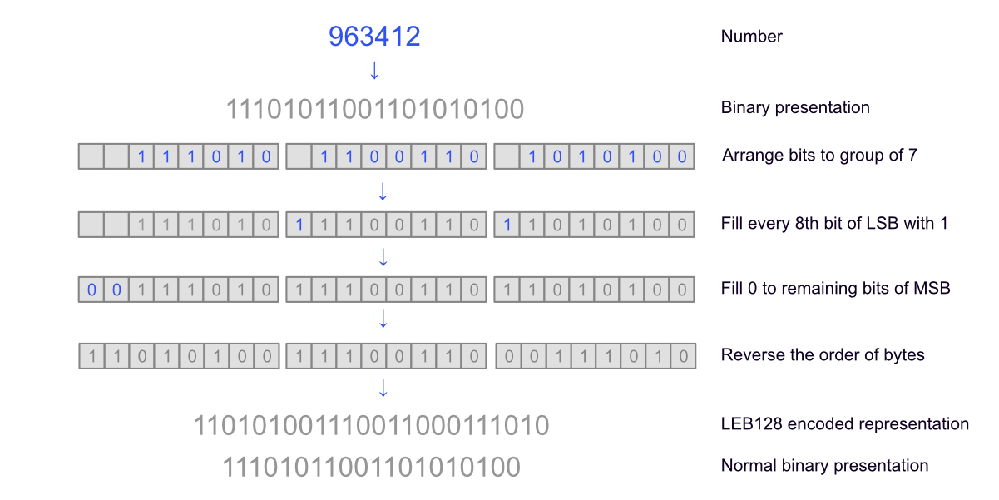

# 内存键值对编码：不定长编码和定长编码

## Slice结构：(Key,Value)对的原始表示

用户插入到LevelDB的键值对(Key-Value)，被表示为可以与C++ 中的std::string 或 以`\0` 结尾的C style的字符串相互转换的 `Slice`结构。`Slice`结构非常简单，中只包含字符串的长度和指向外部字符串的指针，这样做避免了长字符串的拷贝，但是调用者必须保证外部字符串的的生命周期，避免非法访问。例如下面的代码中，由于 slice 指向的 str对象随着if语句的结束而析构，Slice将指向一块被回收过的非法内存。

```c++
leveldb::Slice slice = "hello";
if (slice.ToString() == "hello") {
  std::string str("world")
  slice = str;
}
Use(slice);
```
## Key-Value对在MemTable中的编码

用户插入Key-Value时会调用下面的`Add()`函数，Key-Value对首先会被内部编码，然后插入到中的SkipList里面。编码时最重要的是加入Key和Value的长度信息，这里我们主要看下Key的编码。user_key是变长的，这里加入了8个字节的序列号和值类型信息来表示internal_key，从而限定了LevelDB里面关键码最长为$2^{32}-1-8$。


```c++
void MemTable::Add(SequenceNumber s, ValueType type, const Slice& key,
                   const Slice& value) {
  // Format of an entry is concatenation of:
  //  key_size     : varint32 of internal_key.size()
  //  key bytes    : char[internal_key.size()]
  //  value_size   : varint32 of value.size()
  //  value bytes  : char[value.size()]
  size_t key_size = key.size();
  size_t val_size = value.size();
  size_t internal_key_size = key_size + 8;
  const size_t encoded_len = VarintLength(internal_key_size) +
                             internal_key_size + VarintLength(val_size) +
                             val_size;
  char* buf = arena_.Allocate(encoded_len);
  char* p = EncodeVarint32(buf, internal_key_size);
  std::memcpy(p, key.data(), key_size);
  p += key_size;
  EncodeFixed64(p, (s << 8) | type);
  p += 8;
  p = EncodeVarint32(p, val_size);
  std::memcpy(p, value.data(), val_size);
  assert(p + val_size == buf + encoded_len);
  table_.Insert(buf);
}

typedef SkipList<const char*, KeyComparator> Table;
Table table_;
```

需要注意的是，使用了`varint32`来编码字符串的长度信息，`varint32`最多能编码32位的整数。这里的编码采用的是Base 128 Varints(也叫LEB128编码)，google的`protocol buffer`也是这样编码的。具体步骤如下：

```
1. Convert the number to binary presentation
2. Arrange bits in the group of 7 bits keeping 8th bit empty
3. Fill up every 8th bit of each byte with 1 for least significant bytes (LSB)
4. Fill most significant byte (MSB) remaining bits with 0
5. Reverse the order of bytes
6. You have LEB128 encoded binary representation
```



```c++
int VarintLength(uint64_t v) {
  int len = 1;
  while (v >= 128) {
    v >>= 7;
    len++;
  }
  return len;
}
```

```c++
char* EncodeVarint32(char* dst, uint32_t v) {
  // Operate on characters as unsigneds
  uint8_t* ptr = reinterpret_cast<uint8_t*>(dst);
  static const int B = 128;
  if (v < (1 << 7)) {
    *(ptr++) = v;
  } else if (v < (1 << 14)) {
    *(ptr++) = v | B;
    *(ptr++) = v >> 7;
  } else if (v < (1 << 21)) {
    *(ptr++) = v | B;
    *(ptr++) = (v >> 7) | B;
    *(ptr++) = v >> 14;
  } else if (v < (1 << 28)) {
    *(ptr++) = v | B;
    *(ptr++) = (v >> 7) | B;
    *(ptr++) = (v >> 14) | B;
    *(ptr++) = v >> 21;
  } else {
    *(ptr++) = v | B;
    *(ptr++) = (v >> 7) | B;
    *(ptr++) = (v >> 14) | B;
    *(ptr++) = (v >> 21) | B;
    *(ptr++) = v >> 28;
  }
  return reinterpret_cast<char*>(ptr);
}
```
在查询的时候会在构造LookupKey用memtable_key进行迭代，
```c++
bool MemTable::Get(const LookupKey& key, std::string* value, Status* s) {
  Slice memkey = key.memtable_key();
  Table::Iterator iter(&table_);
  iter.Seek(memkey.data());
  if (iter.Valid()) {
    // entry format is:
    //    klength  varint32
    //    userkey  char[klength]
    //    tag      uint64
    //    vlength  varint32
    //    value    char[vlength]
    // Check that it belongs to same user key.  We do not check the
    // sequence number since the Seek() call above should have skipped
    // all entries with overly large sequence numbers.
    const char* entry = iter.key();
    uint32_t key_length;
    const char* key_ptr = GetVarint32Ptr(entry, entry + 5, &key_length);
    if (comparator_.comparator.user_comparator()->Compare(
            Slice(key_ptr, key_length - 8), key.user_key()) == 0) {
      // Correct user key
      const uint64_t tag = DecodeFixed64(key_ptr + key_length - 8);
      switch (static_cast<ValueType>(tag & 0xff)) {
        case kTypeValue: {
          Slice v = GetLengthPrefixedSlice(key_ptr + key_length);
          value->assign(v.data(), v.size());
          return true;
        }
        case kTypeDeletion:
          *s = Status::NotFound(Slice());
          return true;
      }
    }
  }
  return false;
}
```

内部比较时MemTable 的 KeyComparator 负责从 memtable_key 取出 internalkey，最终排序逻辑是使用 InternalKeyComparator 进行比较，排序规则如下：

1. 优先按照 user key 进行排序。
2. User key 相同的按照 seq 降序排序。
3. User key 和 seq 相同的按照 type 降序排序（逻辑上不会达到这一步，因为一个 LevelDB 的 sequence 是单调递增的）。

```c++
int InternalKeyComparator::Compare(const Slice& akey, const Slice& bkey) const {
  // Order by:
  //    increasing user key (according to user-supplied comparator)
  //    decreasing sequence number
  //    decreasing type (though sequence# should be enough to disambiguate)
  int r = user_comparator_->Compare(ExtractUserKey(akey), ExtractUserKey(bkey));
  if (r == 0) {
    const uint64_t anum = DecodeFixed64(akey.data() + akey.size() - 8);
    const uint64_t bnum = DecodeFixed64(bkey.data() + bkey.size() - 8);
    if (anum > bnum) {
      r = -1;
    } else if (anum < bnum) {
      r = +1;
    }
  }
  return r;
}
```

### 参考
1. https://hackernoon.com/encoding-base128-varints-explained-371j3uz8
2. https://en.wikipedia.org/wiki/Bit_numbering
3. https://developers.google.com/protocol-buffers/docs/encoding#varints

---
```c++
inline void EncodeFixed64(char* dst, uint64_t value) {
  uint8_t* const buffer = reinterpret_cast<uint8_t*>(dst);

  // Recent clang and gcc optimize this to a single mov / str instruction.
  buffer[0] = static_cast<uint8_t>(value);
  buffer[1] = static_cast<uint8_t>(value >> 8);
  buffer[2] = static_cast<uint8_t>(value >> 16);
  buffer[3] = static_cast<uint8_t>(value >> 24);
  buffer[4] = static_cast<uint8_t>(value >> 32);
  buffer[5] = static_cast<uint8_t>(value >> 40);
  buffer[6] = static_cast<uint8_t>(value >> 48);
  buffer[7] = static_cast<uint8_t>(value >> 56);
}
```